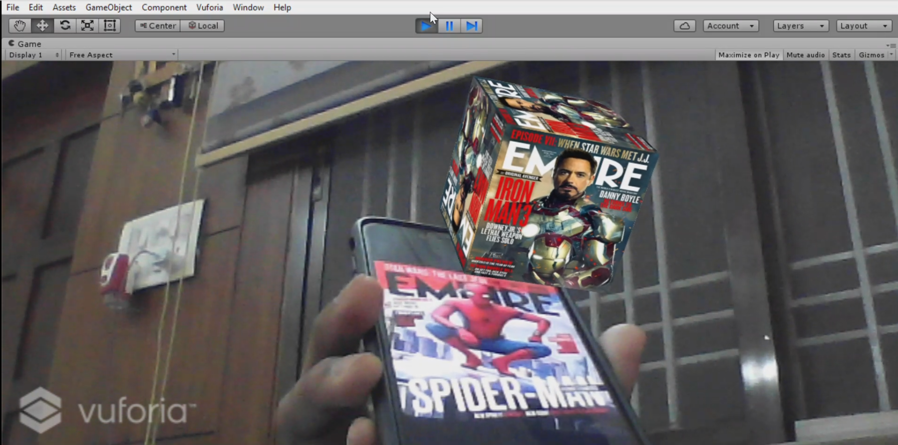

# Augmented Reality Basics

 

This repository contains assignments and projects that I've done while learning basics of Augmented Reality through an online course.

Some of the important concepts that I've learned through this course are -

Vuforia basics -

* Basic Marker AR
* Ground Plane Technology
* Face detection using OpenCV and AR
* Face Recognition
* Object Detection

ARCore fundamentals -

* Motion Tracking
* Point and Plane Detection
* Hit Testing
* Light Estimation
* Vertical Plane Detection and Gesture Control
* Shadows in ARCore
* Augmented Images

and made some basic AR apps using these concepts.

 

## Screenshots and Demo videos

 

Cube rotation using Marker based AR in Vuforia. Checkout the [video](https://youtu.be/YpUff0kS2c8) here.

 

 

Face Recognition using OpenCV and AR in Vuforia. Checkout the [video](https://youtu.be/Fr1N2UPokyo) here.

    Note: Only three images are trained for now.

 

 

Object Detection using OpenCV and AR in Vuforia. Checkout the [video](https://youtu.be/c_n3oyOoO9g) here.

 

 

## Tools and key Technologies Used

* [Unity](https://unity.com/) - Game Engine used.
* [Google ARCore SDK for Unity](https://developers.google.com/ar) and [Vuforia SDK for Unity](https://developer.vuforia.com/downloads/sdk) - To build and integrate AR experience.

Feel free to fork, explore, and do experimental changes!
